# Slice Architecture Diagrams

This document provides comprehensive architectural diagrams showing how the Slice analytics query builder works.

## Table of Contents
- [High-Level System Overview](#high-level-system-overview)
- [Query Execution Flow](#query-execution-flow)
- [Component Interaction Diagram](#component-interaction-diagram)
- [Data Flow Diagram](#data-flow-diagram)
- [Plugin System Architecture](#plugin-system-architecture)
- [Database Driver Architecture](#database-driver-architecture)
- [Metric Type Hierarchy](#metric-type-hierarchy)
- [Query Plan Strategies](#query-plan-strategies)

---

## High-Level System Overview

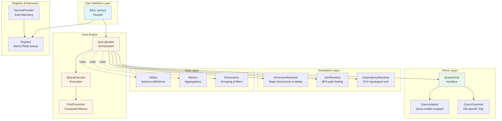

---

## Query Execution Flow

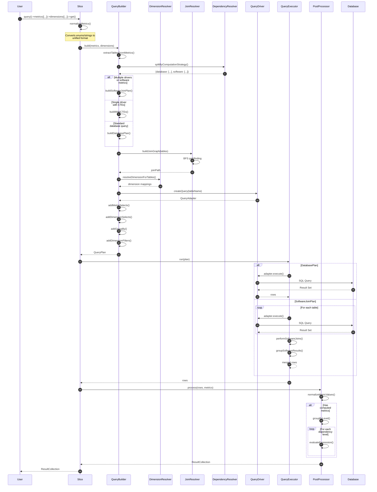

---

## Component Interaction Diagram

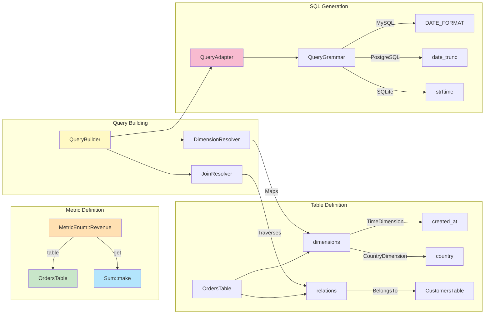

---

## Data Flow Diagram

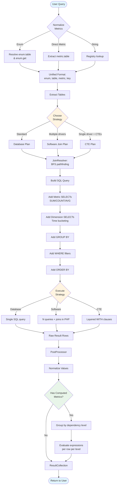

---

## Plugin System Architecture

### Extension Points Overview

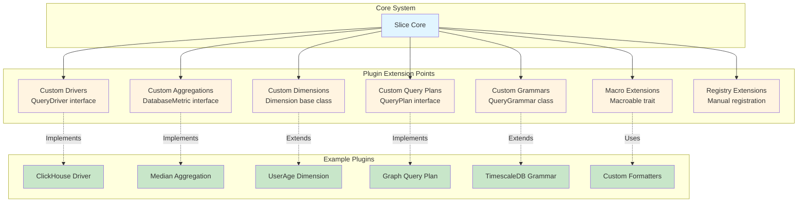

### Plugin Lifecycle

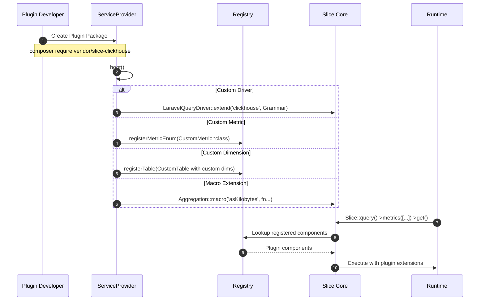

---

## Database Driver Architecture

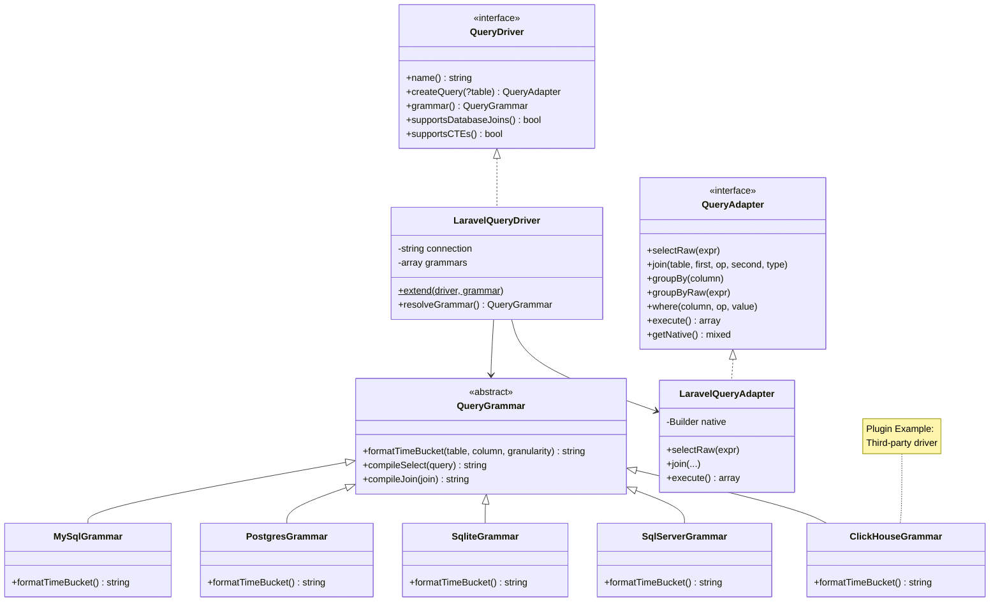

---

## Metric Type Hierarchy

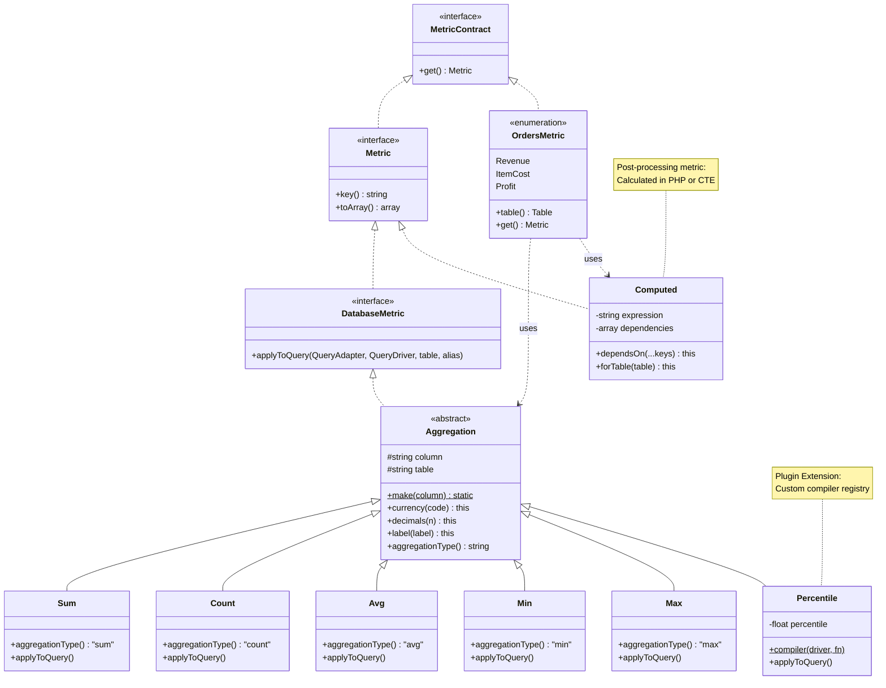

---

## Query Plan Strategies

```mermaid
stateDiagram-v2
    [*] --> AnalyzeQuery

    AnalyzeQuery --> CountTables: Extract tables from metrics

    CountTables --> CheckDriver: Determine driver capabilities

    state CheckDriver {
        [*] --> MultipleDrivers
        MultipleDrivers --> UseSoftwareJoin: Different drivers
        MultipleDrivers --> SingleDriver: Same driver

        SingleDriver --> CheckJoinSupport
        CheckJoinSupport --> SupportsJoins: supportsDatabaseJoins() = true
        CheckJoinSupport --> NoJoinSupport: supportsDatabaseJoins() = false

        SupportsJoins --> CheckComputed
        NoJoinSupport --> UseSoftwareJoin

        CheckComputed --> HasComputed: Has computed metrics
        CheckComputed --> NoComputed: Only direct aggregations

        HasComputed --> CheckCTE
        NoComputed --> UseDatabasePlan

        CheckCTE --> SupportsCTE: supportsCTEs() = true
        CheckCTE --> UseDatabasePlan: supportsCTEs() = false

        SupportsCTE --> UseCTEPlan
    }

    UseDatabasePlan --> BuildDatabasePlan
    UseCTEPlan --> BuildCTEPlan
    UseSoftwareJoin --> BuildSoftwareJoinPlan

    state BuildDatabasePlan {
        [*] --> BFS_Joins
        BFS_Joins --> AddMetrics
        AddMetrics --> AddDimensions
        AddDimensions --> AddGroupBy
        AddGroupBy --> AddFilters
        AddFilters --> AddOrderBy
        AddOrderBy --> [*]
    }

    state BuildCTEPlan {
        [*] --> TopologicalSort
        TopologicalSort --> GroupByLevel
        GroupByLevel --> BuildBaseCTE
        BuildBaseCTE --> BuildComputedCTEs
        BuildComputedCTEs --> BuildFinalSelect
        BuildFinalSelect --> [*]
    }

    state BuildSoftwareJoinPlan {
        [*] --> AnalyzeRelations
        AnalyzeRelations --> CreateTablePlans
        CreateTablePlans --> StoreJoinMetadata
        StoreJoinMetadata --> [*]
    }

    BuildDatabasePlan --> Execute
    BuildCTEPlan --> Execute
    BuildSoftwareJoinPlan --> Execute

    state Execute {
        [*] --> DatabaseExec: DatabasePlan
        [*] --> SoftwareExec: SoftwareJoinPlan

        DatabaseExec --> SingleQuery
        SingleQuery --> DatabaseRows

        SoftwareExec --> MultipleQueries
        MultipleQueries --> HashJoin
        HashJoin --> GroupInPHP
        GroupInPHP --> SoftwareRows

        DatabaseRows --> [*]
        SoftwareRows --> [*]
    }

    Execute --> PostProcess

    state PostProcess {
        [*] --> NormalizeValues
        NormalizeValues --> CheckComputed2
        CheckComputed2 --> EvaluateExpressions: Has computed
        CheckComputed2 --> ReturnResults: No computed
        EvaluateExpressions --> ReturnResults
        ReturnResults --> [*]
    }

    PostProcess --> [*]
```

---

## Join Resolution (BFS Algorithm)

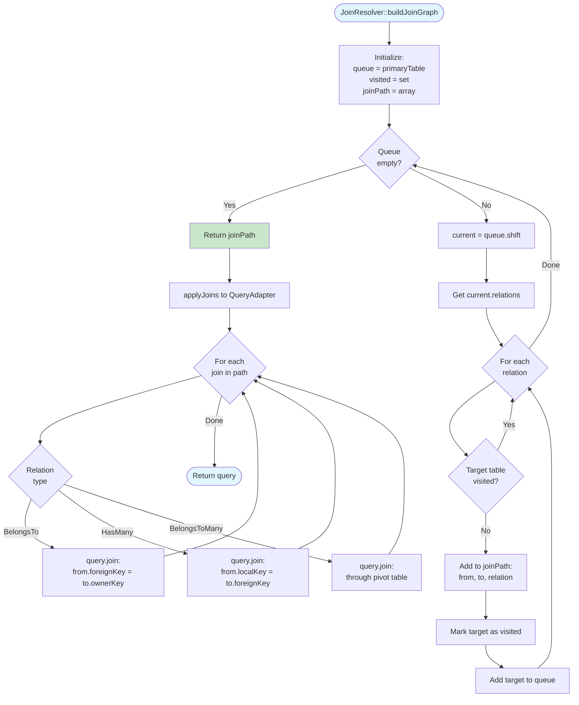

---

## Dimension Resolution

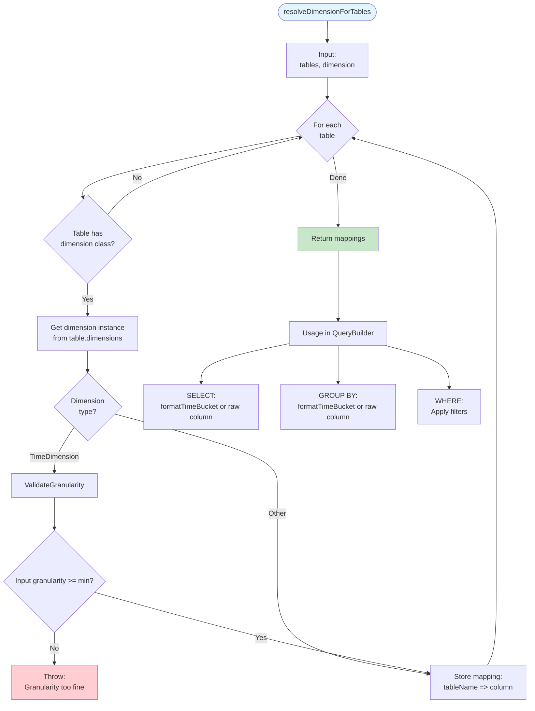

---

## Computed Metrics Dependency Resolution

```mermaid
graph TB
    Start([DependencyResolver::groupByLevel])

    Start --> Build[Build dependency graph]

    Build --> Graph{For each<br/>metric}

    Graph -->|Computed| Extract[Extract dependencies from expression]
    Graph -->|Direct| Level0[Assign to level 0]

    Extract --> AddEdge[Add edges:<br/>metric -> dependencies]
    AddEdge --> Graph

    Graph -->|Done| DFS[DFS Topological Sort]

    DFS --> Visit{For each<br/>unvisited node}

    Visit --> Visiting[Mark as visiting]
    Visiting --> VisitDeps{For each<br/>dependency}

    VisitDeps --> CheckState{Dep state?}

    CheckState -->|Visiting| Cycle[Throw:<br/>Circular dependency]
    CheckState -->|Unvisited| Recurse[Recursively visit]
    CheckState -->|Visited| VisitDeps

    Recurse --> VisitDeps

    VisitDeps -->|Done| Visited[Mark as visited]
    Visited --> CalcLevel[Calculate level:<br/>max(dep levels) + 1]
    CalcLevel --> Visit

    Visit -->|Done| GroupLevels[Group metrics by level]

    GroupLevels --> Output[Output:<br/>level 0: [revenue, cost]<br/>level 1: [profit]]

    Output --> Usage{Usage}

    Usage -->|Database CTEs| CTE[WITH level_0 AS ...<br/>WITH level_1 AS ...]
    Usage -->|PostProcessor| PHP[For each level:<br/>evaluate expressions]

    style Start fill:#e1f5ff
    style Cycle fill:#ffcdd2
    style Output fill:#c8e6c9
```

---

## Registry & Auto-Discovery

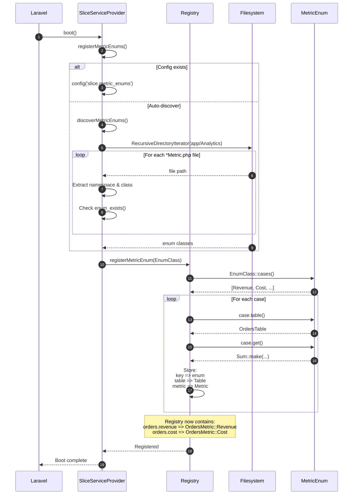

---

## Software Join Execution

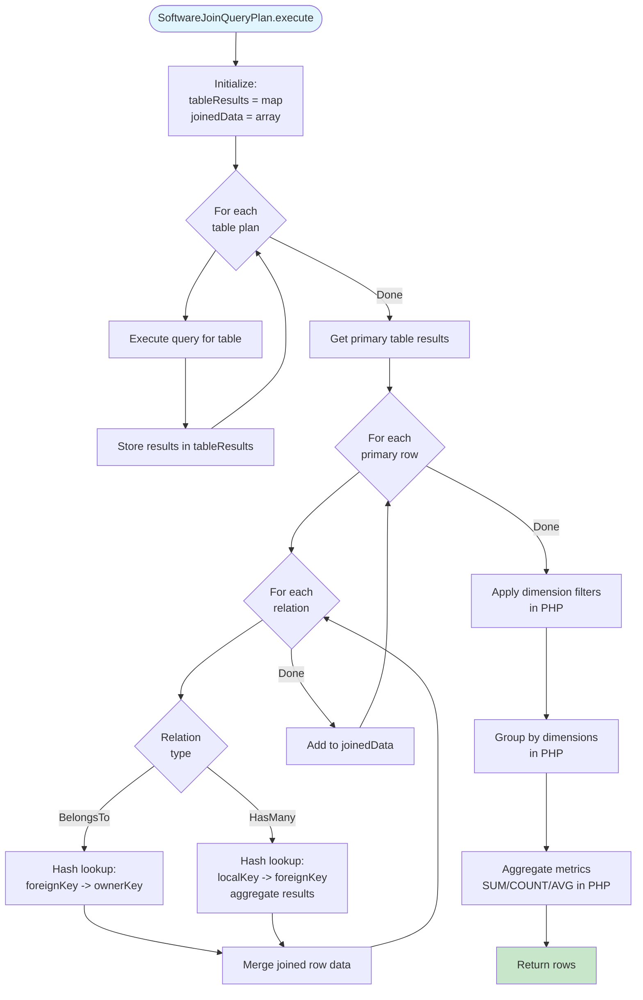

---

## Time Dimension Bucketing

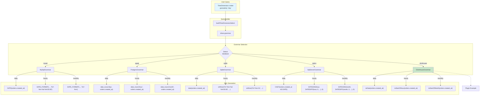

---

## Complete Example Query Flow

```mermaid
graph TD
    Start([User writes query])

    Start --> Code["Slice::query()<br/>.metrics([<br/>  OrdersMetric::Revenue,<br/>  Sum::make('orders.shipping')<br/>])<br/>.dimensions([<br/>  TimeDimension::make('created_at')->daily(),<br/>  CountryDimension::make()->only(['US', 'AU'])<br/>])<br/>.get()"]

    Code --> Normalize[Normalize Metrics:<br/>Revenue -> Sum::make('orders.total')->currency('USD')<br/>Shipping -> Sum::make('orders.shipping')]

    Normalize --> Extract[Extract Tables:<br/>OrdersTable]

    Extract --> Strategy{Choose Strategy:<br/>1 table, no computed metrics}

    Strategy --> BuildDB[DatabaseQueryPlan]

    BuildDB --> BuildQuery[Build SQL Query]

    BuildQuery --> Select["SELECT<br/>  DATE(orders.created_at) as orders_created_at_day,<br/>  orders.country as orders_country,<br/>  SUM(orders.total) as orders_total,<br/>  SUM(orders.shipping) as orders_shipping"]

    Select --> From["FROM orders"]

    From --> Where["WHERE<br/>  orders.country IN ('US', 'AU')"]

    Where --> GroupBy["GROUP BY<br/>  DATE(orders.created_at),<br/>  orders.country"]

    GroupBy --> OrderBy["ORDER BY<br/>  DATE(orders.created_at),<br/>  orders.country"]

    OrderBy --> Execute[Execute Query]

    Execute --> Results["Results:<br/>[<br/>  {<br/>    orders_created_at_day: '2024-01-01',<br/>    orders_country: 'AU',<br/>    orders_total: 15000.00,<br/>    orders_shipping: 450.00<br/>  },<br/>  ...<br/>]"]

    Results --> PostProcess[PostProcessor:<br/>Normalize values]

    PostProcess --> Collection[ResultCollection]

    Collection --> End([Return to user])

    style Start fill:#e1f5ff
    style Code fill:#fff3e0
    style Collection fill:#c8e6c9
    style End fill:#e1f5ff
```

---

