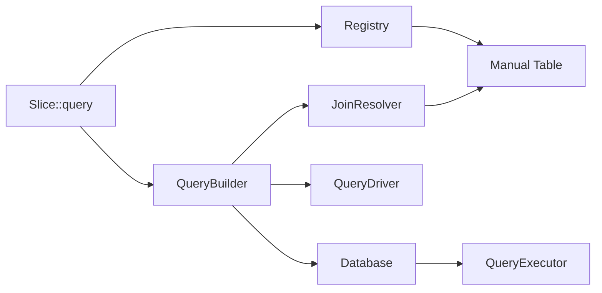
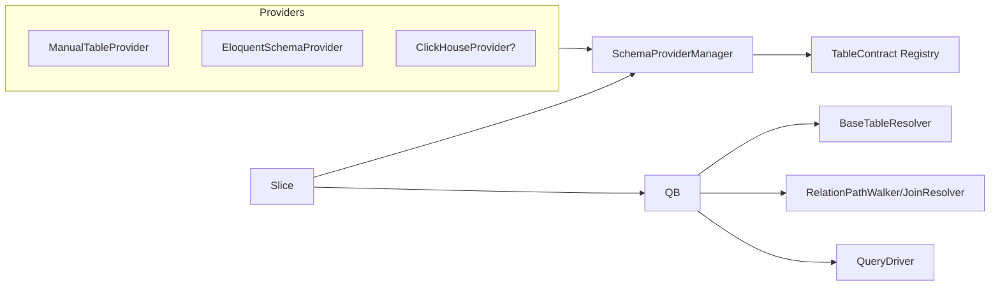

# Slice Eloquent-First Refactor Plan

## 1. Overview

Goal: allow developers to express analytics directly against Eloquent models (`Sum::make('orders.total')`) without
defining bespoke `Table` classes, while keeping today’s table-centric flows fully functional. The refactor introduces a
schema-provider plugin layer so Eloquent metadata, ClickHouse schemas, or any other source can describe
tables/relations/dimensions in a uniform way.

Key requirements:

- Zero raw SQL; remain Laravel Query Builder–first.
- Type-safe APIs (PHP 8.1 enums, typed properties).
- Backward compatibility for existing Table classes and metric enums.
- Support all existing drivers.
- Provide hooks for custom providers (ClickHouse, HTTP, etc.).
- Ship with testing, caching, and migration guidance.

## 2. Current Architecture Snapshot



- Metrics normalize via `Slice::normalizeMetrics()`; every metric must yield a `Table`.
- Registry stores manual tables + dimensions; aggregations look them up by table name.
- JoinResolver traverses hand-authored relations.
- DimensionResolver reads table-declared dimension support.
- Drivers/grammars are already abstracted and stay intact.

## 3. Target Architecture



Highlights:

- `SchemaProvider` contract exposes discovery of tables, relations, and dimensions. Manual tables, Eloquent models, or
  ClickHouse schemas all implement it.
- `SchemaProviderManager` orchestrates providers. Resolution order: explicitly registered tables → provider overrides →
  provider priority order.
- `TableContract` replaces the current abstract `Table`. Manual tables wrap existing behaviour; providers emit contract
  instances from metadata.
- Metrics parse their sources through a `MetricSourceParser`, which asks the manager for the owning provider/table.
- Base-table resolution, relation walking, and dimension inference rely on provider-supplied metadata, not hand-authored
  classes.

## 4. Schema Provider Plugin Model

### 4.1 Contract

```php
interface SchemaProvider
{
    public function boot(SchemaCache $cache): void;
    public function tables(): iterable; // yields TableContract
    public function provides(string $identifier): bool;
    public function resolveMetricSource(string $reference): MetricSource;
    public function relations(string $table): RelationGraph;
    public function dimensions(string $table): DimensionCatalog;
}
```

- Providers can opt into caching by implementing `CachableSchemaProvider`, letting Slice serialize their discovery
  output (`bootstrap/cache/slice-schema.php`).
- `SchemaProviderManager` loads providers from `config('slice.providers')` or runtime registration (
  `Slice::extendSchemaProviders()`), mirroring how drivers register grammars.

### 4.2 Built-in Providers

1. **ManualTableProvider** – wraps existing `Table` subclasses for backward compatibility.
2. **EloquentSchemaProvider** – scans configured model namespaces, reflects relations/casts/scopes, and emits
   metadata-backed `TableContract`s.
3. **ConfigProvider (optional)** – reads schema definitions from config arrays for simple/static sources.

Third parties can publish packages such as `slice-clickhouse-provider` implementing the same interface. The
join/dimension engine remains agnostic to the provider origin.

### 4.3 Metric Source Parsing

- Parser accepts `orders.total`, `connection:orders.total`, or `App\Models\Order::class.'.total'`.
- Sequence:
    1. Ask ManualTableProvider if it owns the table (preserves legacy behaviour).
    2. Walk configured providers (`EloquentSchemaProvider`, etc.) until one returns metadata.
    3. If ambiguous (same table on two connections), throw instructive exception asking for explicit qualifier.
- Parser returns `(TableContract $table, string $column, string $connection)` consumed by aggregations and QueryBuilder.

## 5. Eloquent Schema Discovery

### 5.1 Metadata Extraction

- Scan namespaces (default `app/Models`) recursively.
- Instantiate models via `newInstanceWithoutConstructor()` to avoid expensive boot logic.
- Relations: inspect methods returning `Illuminate\Database\Eloquent\Relations\Relation`; capture type, related model,
  foreign/local keys, pivot tables, morph types, and connection overrides.
- Columns/casts: read `$casts`, `$dates`, `$fillable`, `$guarded`, DB schema introspection (optional, cached) to
  understand column types and indexing hints.
- Store connection name, primary key (including composite hints), increments flag, timestamps, soft-delete status.

### 5.2 Relation Graph

`RelationDescriptor` captures:

```php
new RelationDescriptor(
    name: 'orderLines',
    type: RelationType::HasMany,
    targetModel: OrderLine::class,
    keys: ['local' => 'id', 'foreign' => 'order_id'],
    pivot: null,
    morph: null
);
```

Graph powers JoinResolver and BaseTableResolver without manual tables.

### 5.3 Dimension Catalog

- Translate casts to default dimensions: datetime/date → `TimeDimension`, enums → `EnumDimension`, boolean/tinyint →
  Boolean dimension, `_country` heuristics → `CountryDimension`.
- Allow config-based overrides (`slice.dimensions.cast_map`, `slice.dimensions.column_patterns`) and custom
  `DimensionHintProvider` classes.
- Merge inferred dimensions with manual declarations when both exist.

### 5.4 Caching

- Serialize metadata to `bootstrap/cache/slice-schema.php` with checksums (model file mtimes + composer autoload hash).
- Commands:
    - `php artisan slice:schema-cache` (builds cache, hooks into `artisan optimize`).
    - `php artisan slice:schema-clear`.
    - Optional `slice:schema-profile` to print scan timings for CI.
- Auto-refresh in `local` & `testing` when cache is stale.

## 6. Query Engine Enhancements

### 6.1 Table Contract Adoption

```php
interface TableContract {
    public function name(): string;
    public function connection(): ?string;
    public function relations(): RelationGraph;
    public function dimensions(): DimensionCatalog;
    public function primaryKey(): PrimaryKeyDescriptor;
}
```

- `ManualTable` implements the interface by delegating to legacy `Table`.
- `MetadataBackedTable` wraps provider metadata.
- Registry stores `TableContract` instances regardless of origin.

### 6.2 Base Table Resolver

- Scores candidate tables using:
    - Metric density (number of metrics per table).
    - Dimension coverage.
    - Relationship depth (prefer parents when mixing parent/child metrics).
    - Developer hints (`Slice::query()->baseTable('orders')` / `->baseModel(Order::class)`).
- Provides grain strategies for hasMany relations: `per_parent` (default), `per_child`, or `raw` (no roll-up) configured
  per metric (`Sum::make(...)->grain('parent')`).
- Throws descriptive exceptions when ambiguous to prevent silent double counting.

### 6.3 Relation Path Walker

- Parses dot notation (e.g., `customer.is_new_customer`, `order_lines.product.category`) into join paths using relation
  descriptors.
- Supports multi-hop joins, polymorphic relations (requires morph map), and pivot tables.
- Exposes filter APIs (`->whereRelation('customer.is_new_customer', true)`) that QueryBuilder translates into joins or
  `whereExists` clauses.

### 6.4 Dimension Resolver Updates

- Consume `DimensionCatalog` directly; no need for manual table arrays.
- Supports hybrid scenarios where some dimensions are inferred and others registered manually.
- Validates granularity (time dimensions vs column precision) using metadata.

## 7. Implementation Phases

| Phase | Focus                                      | Deliverables                                        | Tests                                                                         | Risks                                                                                    |
|-------|--------------------------------------------|-----------------------------------------------------|-------------------------------------------------------------------------------|------------------------------------------------------------------------------------------|
| 1     | Schema Provider Manager + manual provider  | Contracts, manager, manual adapter                  | Unit tests for manager ordering & manual provider                             | Minimal                                                                                  |
| 2     | Eloquent provider & caching                | Metadata scanner, cache file, artisan commands      | Scanner unit tests (relations, casts, polymorph), cache invalidation tests    | Reflection hitting heavy model boot logic—mitigate via `newInstanceWithoutConstructor()` |
| 3     | TableContract adoption & metric parser     | Replace abstract `Table`, update registry/metrics   | Regression tests for manual tables + new metadata tables                      | Touches many files—gated by feature flag                                                 |
| 4     | Dimension catalog + heuristics             | Dimension inference, config overrides               | Tests covering cast/name heuristics, manual override merging                  | False positives; ship opt-out per column                                                 |
| 5     | Base table resolver & grain-aware planning | Scoring, metric grain options, updated QueryBuilder | Integration tests (single table, parent/child, multi-table) across DB drivers | Aggregation double counting—prototype with fixtures                                      |
| 6     | Relation path walker + filter DSL          | Multi-hop joins, `whereRelation` APIs               | Feature tests for where clauses across relations, morph/pivot cases           | Query explosions; add planner diagnostics                                                |
| 7     | Docs, migration tooling                    | `planning/` docs, migration guide, release notes    | Backward compatibility suite, CLI guide tests                                 | Adoption friction; provide step-by-step guide                                            |

Each phase is independently testable and can ship behind config toggles.

## 8. API Design & Examples

### Before

```php
Slice::query()
    ->metrics([OrdersMetric::Revenue])
    ->dimensions([TimeDimension::make('created_at')->daily()])
    ->get();
```

### After (Eloquent)

```php
Slice::query()
    ->metrics([
        Sum::make('orders.total')->currency('USD'), // can still be an enum if you want
        Sum::make('order_lines.quantity'),
        Count::make(App\Models\Order::class.'.id'),
    ])
    ->dimensions([TimeDimension::make('orders.created_at')->daily()])
    ->baseModel(App\Models\Order::class)
    ->whereRelation('customer.is_new_customer', true)
    ->get();
```

### Provider Registration

```php
// config/slice.php
return [
    'providers' => [
        \NickPotts\Slice\Providers\ManualTableProvider::class,
        \NickPotts\Slice\Providers\EloquentSchemaProvider::class,
        // \Vendor\Slice\ClickHouseProvider::class,
    ],
];
```

### Manual Opt-Out

```php
class ClickhouseOrdersTable extends ManualTable
{
    public bool $introspect = false; // Skip provider discovery
}
```

## 9. Edge Cases & Handling

| Case                          | Strategy                                                                                                                                                       |
|-------------------------------|----------------------------------------------------------------------------------------------------------------------------------------------------------------|
| Multiple DB connections       | Store connection per table; prevent cross-connection joins unless driver supports them (fallback to software join or throw).                                   |
| Composite / missing PKs       | Providers emit `PrimaryKeyDescriptor`; BaseTableResolver warns when grain lacks PK and requires explicit instructions.                                         |
| Self-referential relations    | Relation graph stores direction + depth; walker prevents infinite loops with visited set.                                                                      |
| Polymorphic relations         | Metadata includes morph type + class map; filters must specify morph class or rely on Eloquent morph map.                                                      |
| Pivot tables                  | Relation descriptors capture pivot table + keys; join planner automatically inserts pivot join when path crosses belongsToMany.                                |
| Soft deletes / global scopes  | Providers flag soft-deletable models; QueryBuilder can skip global scopes by default (configurable).                                                           |
| Accessors/mutators            | Ignored for dimension inference; only actual columns used unless developer registers computed dimension manually.                                              |
| Custom providers (ClickHouse) | Implement `SchemaProvider`; they can introspect system tables or load YAML/JSON schema definitions, benefiting from the same caching + planner infrastructure. |

## 10. Testing Strategy

- **Unit**: Provider manager ordering, schema cache, metric parser ambiguity, base-table scoring, relation path walker
  edge cases.
- **Integration**: Run workbench queries with manual tables disabled to ensure pure Eloquent flow works; repeat under
  MySQL, Postgres, SQLite.
- **Backward Compatibility**: Existing Pest suites untouched; add dual-mode tests verifying manual tables still resolve
  when Eloquent provider disabled.
- **Performance**: CLI benchmark verifying introspection + planning stay within budgets; snapshot tests for generated
  SQL.

## 11. Performance & Deployment

- Reflection occurs only during cache builds; runtime loads cached arrays.
- Provide `slice:schema-cache` command and hook into `artisan optimize`.
- Include diagnostics (`slice:schema-profile`) to highlight slow models/providers.
- Query planning uses metadata graph (O(nodes + edges)) comparable to current BFS.

## 12. Migration Guide (High-Level)

1. Update package and publish new config (`php artisan vendor:publish --tag=slice-config`).
2. Enable Eloquent provider in `config/slice.php`.
3. Warm schema cache: `php artisan slice:schema-cache`.
4. Run existing analytics/tests; fix any ambiguous base grain warnings by adding `->baseTable()` or per-metric
   `->grain()` hints.
5. Gradually remove redundant Table classes; keep manual ones for non-Eloquent sources.
6. (Optional) Add third-party providers (ClickHouse, etc.) using the same plugin interface.

This plan keeps current applications running untouched while unlocking Eloquent-first ergonomics and a pluggable
discovery story future providers can leverage.
